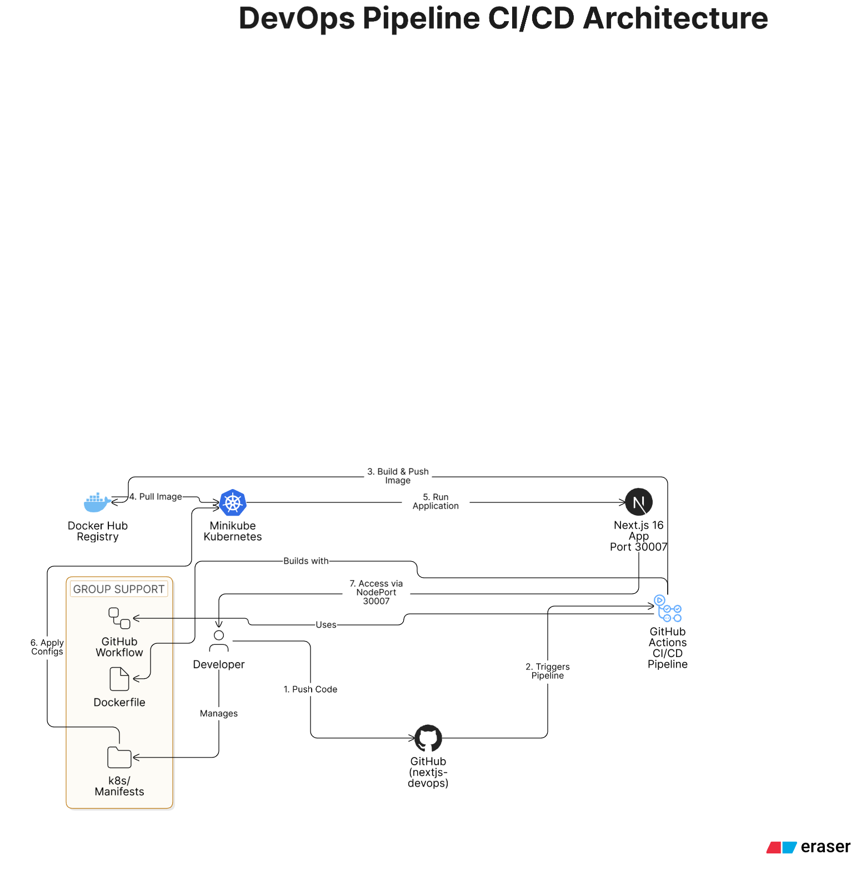

# DevOps Assessment: Containerized Next.js & Kubernetes Orchestration

A high-performance DevOps project showcasing a manually architected CI/CD lifecycle. This project features a TypeScript Next.js application optimized through multi-stage Docker builds and orchestrated within a Kubernetes cluster using Minikube.

## Architecture Features
- **Optimized Multi-Stage Build**: Leverages Docker multi-stage builds and Next.js `standalone` output to reduce image size from ~1GB to 63MB.
- **Kubernetes Orchestration**: Managed via declarative YAML manifests, featuring a Deployment with self-healing replicas and a NodePort Service for traffic routing.
- **Automated CI/CD**: Integrated GitHub Actions pipeline that triggers on every push to validate code, build the production image, and ensure deployment readiness.
- **Type-Safe Infrastructure**: Developed using TypeScript to ensure application stability before the containerization process.

## Project Structure
- **src/app/**: Next.js 15+ application source code using the App Router.
- **k8s/**: Kubernetes manifests including `deployment.yaml` and `service.yaml`.
- **.github/workflows/**: GitHub Actions configuration for automated build pipelines.
- **Dockerfile**: Optimized multi-stage build recipe using Node 20-Alpine.
- **.dockerignore**: Strategic exclusion of `node_modules` and build artifacts to minimize build context.

## Access URLs (Local Testing)
| Component | URL |
| :---: | :---: |
| **Local Next.js** | `localhost:3000` | 
| **K8s Service** | `minikube service devops-app-service --url` |

## Getting Started

### Prerequisites
- Docker & Node.js 20+
- Minikube & Kubectl

### Installation & Deployment
1. Clone the repository: 
   `git clone https://github.com/Nawaf1208/nextjs-devops-assessment.git`

2. Run Locally:
   `npm install && npm run dev`

3. Deploy to Kubernetes:
   `eval $(minikube docker-env)`
   `docker build -t nextjs-devops-assessment:latest .`
   `kubectl apply -f k8s/` 

### Cleanup
To tear down the local infrastructure: `kubectl delete -f k8s/` and `minikube stop`

## Pipeline Stages
1. **Checkout**: Retrieves the latest code from the `main` branch.
2. **Registry Authentication**: Securely logs into Docker Hub using GitHub Secrets (`DOCKER_HUB_USERNAME`, `DOCKER_HUB_ACCESS_TOKEN`).
3. **Build & Push**: Executes the optimized multi-stage build and pushes the final image to the public Docker Hub registry.